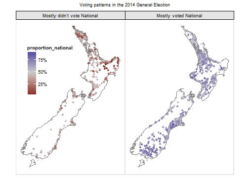
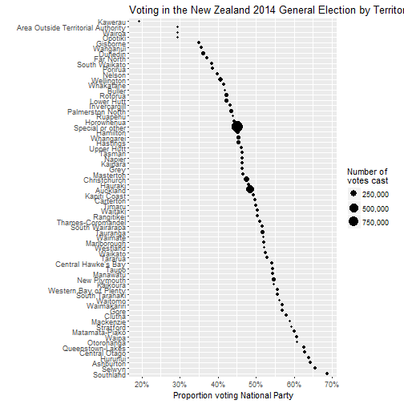

# nzelect
New Zealand election results data in convenient form of an R package

[](https://travis-ci.org/ellisp/nzelect)

## Installation
Currently only available via GitHub.  I'll consider a CRAN version later.

```r
devtools::install_github("ellisp/nzelect/pkg")
library(nzelect)
```


## Overall results
The code below replicates the published results at http://www.electionresults.govt.nz/electionresults_2014/e9/html/e9_part1.html

```r
library(nzelect)
library(tidyr)
library(dplyr)
```

```
## 
## Attaching package: 'dplyr'
```

```
## The following objects are masked from 'package:stats':
## 
##     filter, lag
```

```
## The following objects are masked from 'package:base':
## 
##     intersect, setdiff, setequal, union
```

```r
GE2014 %>%
    mutate(VotingType = paste0(VotingType, "Vote")) %>%
    group_by(Party, VotingType) %>%
    summarise(Votes = sum(Votes)) %>%
    spread(VotingType, Votes) %>%
    select(Party, PartyVote, CandidateVote) %>%
    ungroup() %>%
    arrange(desc(PartyVote))
```

```
## Source: local data frame [28 x 3]
## 
##                               Party PartyVote CandidateVote
##                               (chr)     (dbl)         (dbl)
## 1                    National Party   1131501       1081787
## 2                      Labour Party    604535        801287
## 3                       Green Party    257359        165718
## 4           New Zealand First Party    208300         73384
## 5                      Conservative     95598         81075
## 6                     Internet MANA     34094            NA
## 7                       Maori Party     31849         42108
## 8                   ACT New Zealand     16689         27778
## 9  Aotearoa Legalise Cannabis Party     10961          4936
## 10             Informal Party Votes     10857            NA
## ..                              ...       ...           ...
```


## Comparing party and candidate votes of several parties

```r
library(ggplot2, quietly = TRUE)
```

```
## Need help getting started? Try the cookbook for R:
## http://www.cookbook-r.com/Graphs/
```

```r
library(scales, quietly = TRUE)
library(GGally, quietly = TRUE) # for ggpairs
```

```
## 
## Attaching package: 'GGally'
```

```
## The following object is masked from 'package:dplyr':
## 
##     nasa
```

```r
library(gridExtra, quietly = TRUE) # for grid.arrange
```

```
## 
## Attaching package: 'gridExtra'
```

```
## The following object is masked from 'package:dplyr':
## 
##     combine
```

```r
library(dplyr)

proportions <- GE2014 %>%
    group_by(VotingPlace, VotingType) %>%
    summarise(ProportionLabour = sum(Votes[Party == "Labour Party"]) / sum(Votes),
              ProportionNational = sum(Votes[Party == "National Party"]) / sum(Votes),
              ProportionGreens = sum(Votes[Party == "Green Party"]) / sum(Votes),
              ProportionNZF = sum(Votes[Party == "New Zealand First Party"]) / sum(Votes),
              ProportionMaori = sum(Votes[Party == "Maori Party"]) / sum(Votes))

ggpairs(proportions, aes(colour = VotingType), columns = 3:5)
```


## Geographical location of voting places

```r
source("https://gist.githubusercontent.com/briatte/4718656/raw/2c4e71efe6d46f37e7ea264f5c9e1610511bcb09/ggplot2-map-theme.R")

GE2014 %>%
    filter(VotingType == "Party") %>%
    group_by(VotingPlace) %>%
    summarise(ProportionNational = sum(Votes[Party == "National Party"] / sum(Votes))) %>%
    left_join(Locations2014, by = "VotingPlace") %>%
    filter(VotingPlaceSuburb != "Chatham Islands") %>%
    mutate(MostlyNational = ifelse(ProportionNational > 0.5, 
                                   "Mostly voted National", "Mostly didn't vote National")) %>%
    ggplot(aes(x = WGS84Longitude, y = WGS84Latitude, colour = ProportionNational)) +
    geom_point() +
    facet_wrap(~MostlyNational) +
    coord_map() +
    borders("nz") +
    scale_colour_gradient2(label = percent, mid = "grey80", midpoint = 0.5) +
    theme_map() +
    theme(legend.position = c(0.04, 0.55)) +
    ggtitle("Voting patterns in the 2014 General Election\n")
```

```
## 
##  # maps v3.1: updated 'world': all lakes moved to separate new #
##  # 'lakes' database. Type '?world' or 'news(package="maps")'.  #
```

```
## Loading required package: grid
```



See this [detailed interactive map of of the 2014 general election](https://ellisp.shinyapps.io/NZ-general-election-2014/) 
built as a side product of this project.

## Rolling up results to Regional Council, Territorial Authority, or Area Unit
Because this package matches the location people actually voted with to boundaries 
of Regional Council, Territorial Authority and Area Unit it's possible to roll up 
voting behaviour to those categories.  However, a large number of votes cannot be
located this way.  And it needs to be remembered that people are not necessarily voting
near their normal place of residence.

```r
GE2014 %>%
    filter(VotingType == "Party") %>%
    left_join(Locations2014, by = "VotingPlace") %>%
    group_by(REGC2014_N) %>%
    summarise(
        TotalVotes = sum(Votes),
        ProportionNational = round(sum(Votes[Party == "National Party"]) / TotalVotes, 3)) %>%
    arrange(ProportionNational)
```

```
## Source: local data frame [17 x 3]
## 
##                  REGC2014_N TotalVotes ProportionNational
##                      (fctr)      (dbl)              (dbl)
## 1           Gisborne Region      14342              0.351
## 2             Nelson Region      18754              0.398
## 3          Northland Region      53688              0.427
## 4         Wellington Region     165207              0.430
## 5  Manawatu-Wanganui Region      78841              0.447
## 6              Otago Region      75933              0.447
## 7                        NA     934589              0.451
## 8        Hawke's Bay Region      53833              0.460
## 9             Tasman Region      17935              0.465
## 10        West Coast Region      12226              0.465
## 11     Bay of Plenty Region      89065              0.473
## 12          Auckland Region     478760              0.486
## 13           Waikato Region     134511              0.512
## 14        Canterbury Region     192577              0.520
## 15       Marlborough Region      17474              0.520
## 16         Southland Region      36158              0.528
## 17          Taranaki Region      42586              0.552
```

```r
# what are all those NA Regions?:
GE2014 %>%
    filter(VotingType == "Party") %>%
    left_join(Locations2014, by = "VotingPlace") %>%
    filter(is.na(REGC2014_N)) %>%
    group_by(VotingPlace) %>%
    summarise(TotalVotes = sum(Votes))
```

```
## Source: local data frame [7 x 2]
## 
##                                               VotingPlace TotalVotes
##                                                     (chr)      (dbl)
## 1 Chatham Islands Council Building, 9 Tuku Road, Waitangi         90
## 2                       Ordinary Votes BEFORE polling day     630775
## 3          Overseas Special Votes including Defence Force      38316
## 4                        Special Votes BEFORE polling day      71362
## 5                            Special Votes On polling day     151530
## 6                            Votes Allowed for Party Only      40986
## 7        Voting places where less than 6 votes were taken       1530
```

```r
GE2014 %>%
    filter(VotingType == "Party") %>%
    left_join(Locations2014, by = "VotingPlace") %>%
    group_by(TA2014_NAM) %>%
    summarise(
        TotalVotes = sum(Votes),
        ProportionNational = round(sum(Votes[Party == "National Party"]) / TotalVotes, 3)) %>%
    arrange(desc(ProportionNational)) %>%
    mutate(TA = ifelse(is.na(TA2014_NAM), "Special or other", as.character(TA2014_NAM)),
           TA = gsub(" District", "", TA),
           TA = gsub(" City", "", TA),
           TA = factor(TA, levels = TA)) %>%
    ggplot(aes(x = ProportionNational, y = TA, size = TotalVotes)) +
    geom_point() +
    scale_x_continuous("Proportion voting National Party", label = percent) +
    scale_size("Number of\nvotes cast", label = comma) +
    labs(y = "", title = "Voting in the New Zealand 2014 General Election by Territorial Authority")
```




