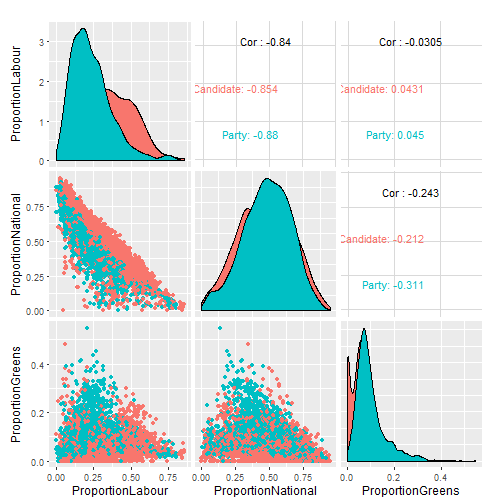

# nzelect
New Zealand election results data in convenient form of an R package


```r
library(ggplot2, quietly = TRUE)
library(scales, quietly = TRUE)
library(GGally, quietly = TRUE) # for ggpairs
library(gridExtra, quietly = TRUE) # for grid.arrange
library(dplyr)

proportions <- GE2014 %>%
    group_by(VotingPlace, VotingType) %>%
    summarise(ProportionLabour = sum(Votes[Party == "Labour Party"]) / sum(Votes),
              ProportionNational = sum(Votes[Party == "National Party"]) / sum(Votes),
              ProportionGreens = sum(Votes[Party == "Green Party"]) / sum(Votes),
              ProportionNZF = sum(Votes[Party == "New Zealand First Party"]) / sum(Votes),
              ProportionMaori = sum(Votes[Party == "Maori Party"]) / sum(Votes))

ggpairs(proportions, aes(colour = VotingType), columns = 3:5)
```




```r
source("https://gist.githubusercontent.com/briatte/4718656/raw/2c4e71efe6d46f37e7ea264f5c9e1610511bcb09/ggplot2-map-theme.R")

GE2014 %>%
    filter(VotingType == "Party") %>%
    group_by(VotingPlace) %>%
    summarise(ProportionNational = sum(Votes[Party == "National Party"] / sum(Votes))) %>%
    left_join(Locations2014, by = "VotingPlace") %>%
    filter(VotingPlaceSuburb != "Chatham Islands") %>%
    mutate(MostlyNational = ifelse(ProportionNational > 0.5, 
                                   "Mostly voted National", "Mostly didn't vote National")) %>%
    ggplot(aes(x = WGS84Longitude, y = WGS84Latitude, colour = ProportionNational)) +
    geom_point() +
    facet_wrap(~MostlyNational) +
    coord_map() +
    borders("nz") +
    scale_colour_gradient2(label = percent, mid = "grey80", midpoint = 0.5) +
    theme_map() +
    theme(legend.position = c(0.04, 0.55)) +
    ggtitle("Voting patterns in the 2014 General Election\n")
```


